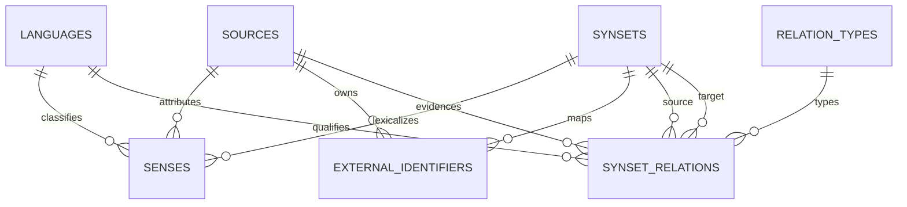

# STEP 01 — Canonical Data Model

## Decision

Babelix is a **BabelNet-like** knowledge graph with independently ingested,
license-tracked data. It is not a proxy, crawler, or redistributed copy of
BabelNet. The centre of the model is a **Synset**: one canonical, language-
independent unit representing either an `ENTITY` (for example, the University
of Zanjan) or a `CONCEPT` (for example, university).

`Synset.id` is an internal UUID for relational integrity. `canonical_id` is a
stable public identifier owned by Babelix, such as `kg:entity:university-of-
zanjan`; a BabelNet ID, where legitimately available, belongs in
`external_identifiers`, not in the primary key.

## ERD



## Core tables and their responsibilities

| Table | Responsibility | Key invariants |
| --- | --- | --- |
| `languages` | ISO-like language codes, such as `fa` and `en`. | Code is the primary key. |
| `sources` | Dataset name, version, URL, and licence. | Never merge source provenance into an opaque JSON field. |
| `synsets` | Canonical graph nodes. | Internal UUID and public `canonical_id` are distinct; type is `ENTITY` or `CONCEPT`. |
| `senses` | A source-backed lexicalization of one synset. | Display lemma and normalized lookup lemma are both retained. |
| `relation_types` | Behaviour of graph predicates. | Inverse, directed, symmetric, and transitive semantics are data, not application constants. |
| `synset_relations` | Provenance-aware, directed graph edges. | No self edge; confidence is in `[0, 1]`; edge uniqueness includes source. |
| `external_identifiers` | Links a synset to a source-system ID. | A `(source, external_id)` maps to only one canonical synset. |

## Why Entity is not a separate root table

An entity and a concept need the same capabilities: labels in many languages,
external identifiers, definitions, and typed outgoing graph edges. Splitting
them would duplicate those structures and complicate traversal. The `type`
field therefore distinguishes their semantics while `synsets` remains the
single node table. Future entity-specific claims can reference `synsets.id`.

## Persian normalization rule

The `senses.lemma` field is the source/display form. `normalized_lemma` is a
separate match key. The first normalizer converts Arabic `ي`/`ك` variants,
removes diacritics and tatweel, treats ZWNJ as a word boundary, normalizes
Unicode, and collapses whitespace. It must never overwrite the display form;
normalization rules can evolve without losing source evidence.

## Example: University of Zanjan

```text
Synset: kg:entity:university-of-zanjan (ENTITY)
  senses: fa "دانشگاه زنجان", en "University of Zanjan"
  external IDs: WIKIDATA:Q…, WIKIPEDIA_FA:دانشگاه_زنجان
  edges:
    INSTANCE_OF -> kg:concept:university
    LOCATED_IN  -> kg:entity:zanjan
    COUNTRY     -> kg:entity:iran
```

Each edge carries its own `source_id`, optional source version (through
`sources`), confidence, and metadata. Conflicting assertions can therefore
coexist and be inspected rather than silently overwritten.

## Deliberate STEP 01 boundaries

This step defines the canonical core only. Glosses, examples, domains, media,
ETL job checkpoints, entity-resolution candidates, OpenSearch, Redis, Celery,
and Neo4j projection are postponed. PostgreSQL remains the transactional source
of truth; later search and graph systems consume projections from it.

## Next step

STEP 02 creates PostgreSQL/Alembic infrastructure and turns these models into
reviewable migrations, including reference-data seeds for languages, sources,
and relation types.
